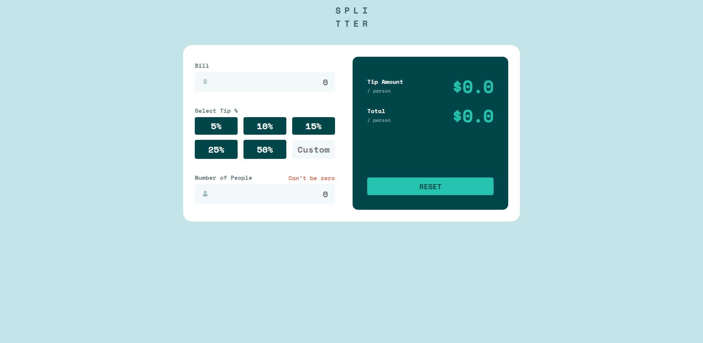

# Spliter - tip calulator

## Table of contents

- [Overview](#overview)
  - [The challenge](#the-challenge)
  - [Screenshot](#screenshot)
  - [Links](#links)
- [My process](#my-process)
  - [Built with](#built-with)
- [Author](#author)

## Overview

### The challenge

Users should be able to:

- View the optimal layout depending on their device's screen size
- See hover states for interactive elements
- Error message will display when the number of people set to 0
- Custom percentage of a tip can be assigned
- Calculate tip per person
- Calculate total (tip included) per person

### Screenshot

### Links

- Github Repository: https://github.com/Glebkas/tip-calculator-app-main
- Live Site URL: https://glebkas.github.io/tip-calculator-app-main/

## My process

### Built with

- Semantic HTML5 markup
- CSS custom properties
- Flexbox
- CSS Grid
- JavaScript

## Author

Guy Gleb Kasner
